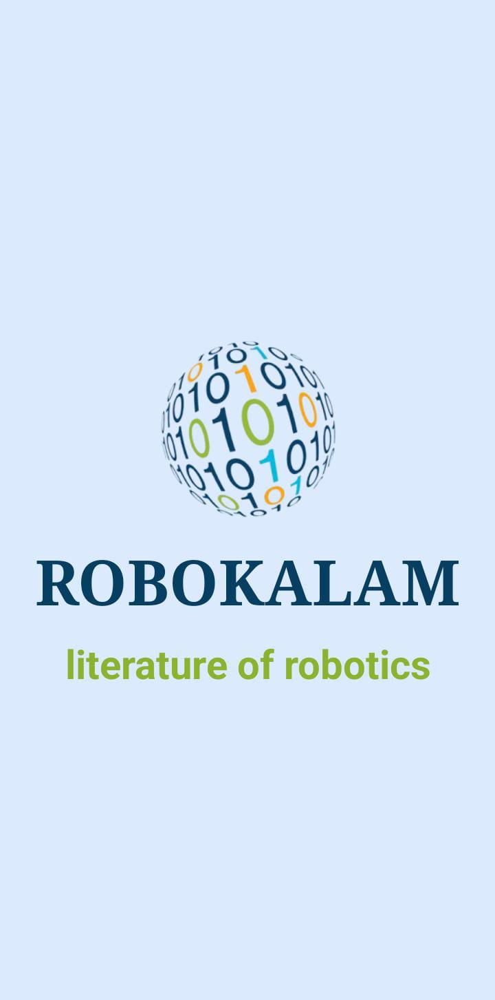
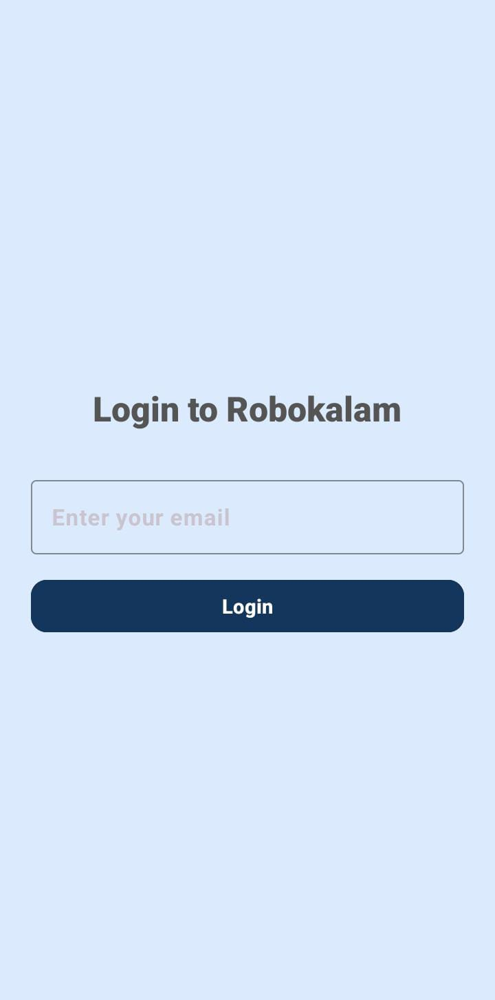
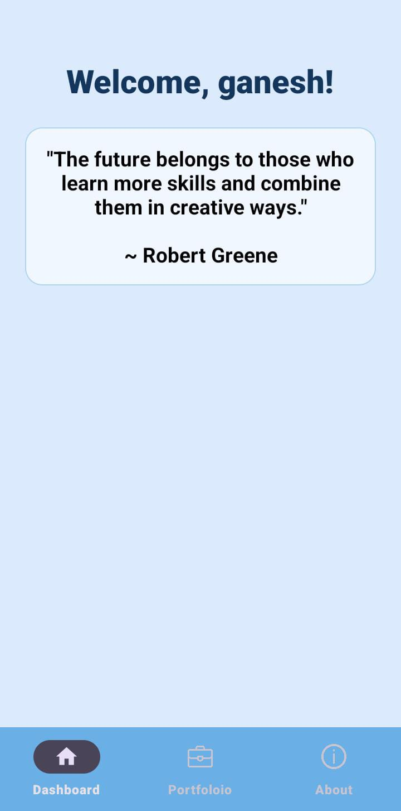

Great! Since I'm familiar with your Android app and its features, here's a complete and well-structured `README.md` file tailored for your project. This will make your repository look professional and explain the app clearly to users, recruiters, or contributors.

---

## 📱 Robokalam Android App

Robokalam is a multi-feature Android application developed to demonstrate user login, local data storage, API integration, and clean UI navigation using **Java**. It’s designed with a focus on **user experience**, **modularity**, and **robust local + remote data handling**.

---

### 🚀 Features

1. **🔒 Splash + Login (SharedPreferences)**

   * Displays an animated splash screen with logo and app name.
   * Email-based login using SharedPreferences (no authentication server).
   * Login session maintained across app restarts.

2. **🏠 Dashboard**

   * Displays a personalized welcome message using the user’s email prefix.
   * Fetches and displays a **Quote of the Day** from the [ZenQuotes API](https://zenquotes.io/).
   * Shows “Add Portfolio” button **only once on first login**.

3. **📝 Add Portfolio (SQLite)**

   * Custom dialog to input name, college, 3 skills, project title, and description.
   * Stored locally in SQLite database.
   * Associated uniquely with the logged-in email.
   * Input validation with user-friendly error handling.

4. **👤 About Robokalam**

   * Static screen with info about Robokalam and an image/logo.

---

### 🧱 Tech Stack

| Category    | Tools/Tech                      |
| ----------- | ------------------------------- |
| Language    |  Java                           |
| UI          | XML, Fragments, ViewBinding     |
| Storage     | SharedPreferences, SQLite       |
| Network/API | HttpURLConnection, JSON         |
| IDE         | Android Studio                  |
| Design      | Material Design + Custom Styles |

---

### 🗂️ Project Structure

```
Robokalam/
├── java/
│   ├── com.project.robokalam/
│   │   ├── Fragments/
│   │   │   ├── DashboardFragment.java
│   │   │   ├── PortfolioFragment.java
│   │   ├── Database/
│   │   │   ├── SQLiteHelper.java
│   │   ├── Model/
│   │   │   ├── PortfolioModel.java
│   ├── res/
│   │   ├── layout/
│   │   │   ├── fragment_dashboard.xml
│   │   │   ├── fragment_portfolio.xml
│   │   ├── drawable/
│   │   ├── values/
│   │   └── ...
├── screenshots/
│   ├── splash.png
│   ├── login.png
│   └── dashboard.png
└── README.md

---

### 🖼️ Screenshots (Optional)

| Splash Screen                            | Login Page                          | Dashboard                                   |
| ---------------------------------------- | ----------------------------------- | ------------------------------------------- |
|     |  |  |

---

### ⚙️ How to Run the Project

1. Clone the repo:

   ```bash
   git clone https://github.com/GaneshShinde01/Robokalam.git
   ```

2. Open in **Android Studio**.

3. Connect an emulator or real device.

4. Click **Run ▶️** to launch the app.

---

### 📡 API Used

* [ZenQuotes API](https://zenquotes.io/api/today) – returns motivational quote of the day.

  ```json
  [
    {
      "q": "Don’t wait. The time will never be just right.",
      "a": "Napoleon Hill"
    }
  ]
  ```

---

### ✅ Best Practices Used

* MVVM-friendly code separation (Activity → Fragment → DB/API).
* Exception handling and user feedback for all DB/API operations.
* SharedPreferences used per user (by email).
* Dialog input validation and custom UI.
* Clean UI with Material styles.

---

### 🙋‍♂️ Developed By

**Ganesh Shinde**
📍 Latur, Maharashtra
🎓 BSc Computer Science – 9.5 CGPA
💼 Android Developer | Full Stack Learner
🔗 [LinkedIn](https://linkedin.com/in/ganesh-shinde-s01/) • [GitHub](https://github.com/GaneshShinde01)

---


